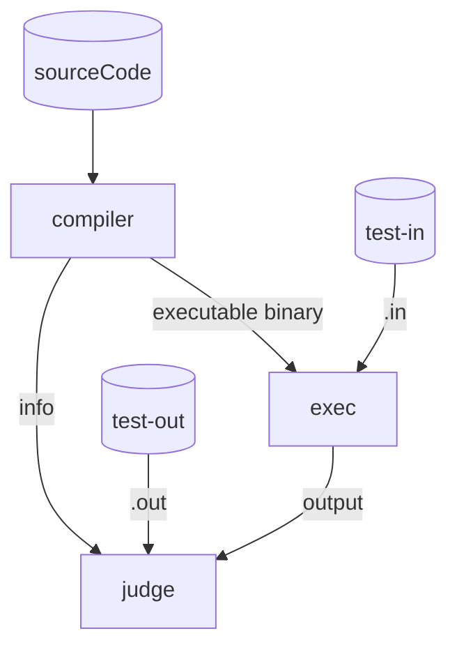

# Projekt grupowy 2024/2025

## Simplified process flowchart

---
> [!TIP]
>  How to run demo:
> 1. Go to the root repository directory.
> 2. Run `src/conf/example_generator_sum.py` to generate example test data.
> 3. Run `src/example/demo.py` to check the example source code using the previously generated test data.

> [!WARNING]
> If you want to deploy the demo, you have to install all requirements manually.

